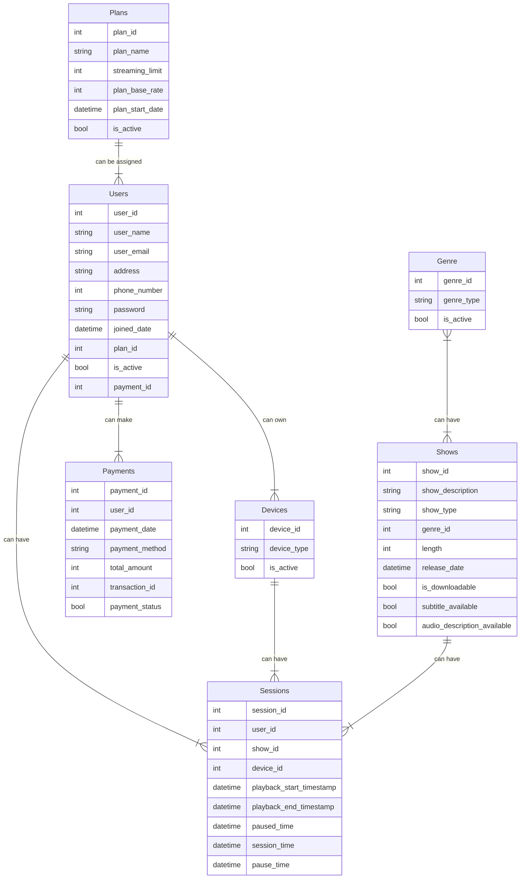
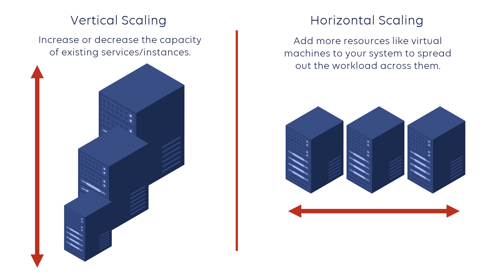

# Problem Statement
Develop a high level design of a robust and user-centric video streaming service that offers a vast library of TV shows, and movies, delivering a seamless, and personalized viewing experience across multiple platforms on subscription basis.

# Agenda
This document aims to develop the high level design of the said system, while describing the principles of high level design.

# What is System Design?
System design is the process of defining the architecture, components, modules, and interfaces of a software system to ensure it meets the specified requirements. It involves breaking a complex system down into smaller, manageable parts while considering factors like performance, scalability, maintainability, and security.

### Key aspects of system design
- Architectural patterns: Selecting appropriate architectural styles (e.g., layered, microservices, event-driven) based on the system's requirements and goals.
- Component design: Designing individual components or modules within the system, defining their responsibilities and interactions.
- Data flow: Modeling how data flows through the system, including input, processing, and output.
- Interface design: Specifying how components communicate with each other, including the data exchanged and the protocols used.
- Non-functional requirements: Considering factors like performance, scalability, security, and maintainability during the design process.

### Phases in system design
System design is typically performed in 2 phases,
1. High level design (HLD): Provides a conceptual averview of the system's architecture, focusing on the major components and their interactions.
2. Low level design (LLD): Defines the detailed design of individual components, including data structures, algorithms, and interfaces.

### How to select the appropriate architectural pattern for the system?
The concept of logical separation is used to achieve this. Logical separation in system design refers to the process of dividing a system into distinct functional units or modules based on their logical relationships and responsibilities. This separation helps to,
- Improve modularity: Each module can be developed, tested, and maintained independently, enhancing code organization and reusability.
- Enhance maintainability: Changes to one module are less likely to impact other parts of the system, reducing the risk of unintended side effects.
- Promote reusability: Well-defined modules can be reused in other projects, saving development time and effort.
- Improve understandability: The system becomes easier to understand and reason about when it is logically separated into cohesive units.

Common techniques for logical separation are,
- Layered architecture: The system is divided into layers based on their logical functions, such as presentation, business logic, and data access. Each layer is responsible for specific tasks, promoting separation of concerns and improving maintainability.
- Microservices architecture: The system is broken down into small, independently deployable services, each focused on a specific business capability. This approach emphasizes logical separation and enables scalability and flexibility.
- Component based architecture: The system is built from reusable components that provide specific functionalities. These components are designed to be independent and can be combined in different ways to create various applications, promoting logical separation and code reuse.

# What is High Level Design?
High level design (HLD) is a conceptual representation of a software system's architecture, focusing on the overall structure, components, and their interactions. It provides a blueprint for the system's design, outlining the key modules, their responsibilities, and how they communicate with each other.

HLD serves as a foundation for the detailed design phase, providing a clear direction for the development team. It helps in,
- Understanding the system as a whole.
- Identifying dependencies between different modules.
- Evaluating different architectural design alternatives.
- Communicating design decisions with all the stake holders.

HLD is essentially a bridge between the problem domain and the detailed design. It helps in laying down a roadmap for building a robust and efficient software system

### Key elements of HLD
- System architecture: The overall structure and organization of the system, often depicted using diagrams like UML (Unified Modeling Language) component diagrams.
- Module identification: Breaking down the system into logical components or modules, each with a specifci purpose.
- Module relationships: Defining how modules interact with each other, including data flow and control flow.
- Interfaces: Specifying the communication points between modules including the data exchanged and the protocols used.
- Non-functional requirements: Considering factors like performance, security, scalability, and maintainability.

# Functional Requirements of a Video Streaming Platform

### Content library
- Extensive catalog of movies, TV shows, docuseries, and other video content.
- Ability to categorize content by genre, release year, rating, and other relevant criteria.
- Support for different languages and subtitles.

### User profiles
- Allow users to create personalized profiles with viewing history, recommendations, and watchlists.
- Support for multiple profiles within a single account.

### Video playback
- High-quality video playback with adaptive streaming to adjust to varying network connections.
- Support for multiple resolutions and frame rates.
- Ability to pause, resume, rewind and fast-forward videos.

### Search and discovery
- Efficient search functionality to find specific content.
- Personalized recommendations based on viewing history and preferences.
- Curated collections and playlists.

### Offline viewing
- Support to download content for offline viewing on compatible devices.

### Social features
- Users should have an option to like, comment, and rate content.
- Social sharing options to share content with friends and family.

### Payment support
- Support should be available for most of the popular payment methods (Debit Card, Credit Card, UPI, etc.).

### Parental controls
- Restricted profiles to limit content access for childern.
- PIN protection for parental controls.

### Multi-device support
- Compatibility with various devices, including smartphones, tablets, computers, and smart TVs.

# Non-Functional Requirements for a Video Streaming Platform
Non-functional requirements (NFRs) define the quality attribute of a system, ensuring it meets user expectations and operates effectively.

### Performance
- Response time: Ensure quick response times for user actions, such as searching, playing and pausing videos.
- Throughput: Handle a large number of concurrent users and streams without significant degradation in performance.
- Scalability: The system should be able to scale up or down to accomodate changes in user demand.
- Buffering: Minimize buffering during video playback, especially over slower etwork connections.

### Reliability
- Uptime: Maintain high availability and minimize downtime.
- Data integrity: Ensure data consistency and accuracy, including user profiles, viewing history, and content metadata.
- Error handling: Implement robust error handling mechanisms to gracefully handle exceptions and prevent system crashes.

### Security
- Data privacy: Protect user data, including personal information and viewing history from unauthorized access.
- Content protection: Prevent unauthorized copying, distribution or privacy of content.
- Secure authentication: Implement secure authentication and authorization mechanisms to protect user accounts.
- Compliance: Adhere to relevant data privacy regulations (e.g., GDPR, CCPA).

### Usability
- User interface: Design an intuitive and user-friendly interface that is easy to navigate.
- Accessibility: Ensure the platform is accessible to users with disabilities.
- Localization: Support multiple languages and regions to cater to a global audience.

### Maintainability:
- Modularity: Design the system with well-defined modules to facilitate maintenance and updates.
- Documentation: Provide comprehensive documentation for developers and administrators.
- Testability: Ensure the system is testable with automated testing tools and frameworks.

### Cost
- Cost-effectiveness: Optimize resource utilization and minimize operational costs.
- Scalability: The system should be scalable to accommodate growth without excessive cost.

# Assumptions About the Video Streaming Platform
1. The platform has atleast 1 billion users, and out of those atleast 200 million are active users.
2. The has atleast 1 million videos.
3. The platform sees atleast 1000 videos being uploaded everyday.
4. The platform witnesses at least 1 billion requests per day (12000 requests per day).

# Data Model (ER Diagram) for the Video Streaming Platform
The following is a mock ER diagram showing the different possible entities that a database of a video streaming platform can have,

An ER (Entity-Relationship) diagram shows the different entities in a database and the relationship between them.

# What is a Database?
When designing a video streaming platform, the choice of database system is crucial for efficiently storing and managing large amounts of data, handling real-time operations, and scaling to meed growing user demands. There are 2 primary categories of databases,
1. SQL (Relational)
2. NoSQL (Non-Relational)

### SQL databases
SQL databases, like MySQL, PostgreSQL, and Oracle, are well-suited for structured data with defined schemas. They organize data into tables with rows and columns, enforcing relationships between data elements through primary and foreign keys.

Advantages of SQL databases,
- Structured data: Ideal for storing well-defined data with clear relationships.
- ACID properties: Ensure data integrity and consistency through atomicity, consistency, isolation and durability.
- Query language: Powerful SQL language for querying, manipulating, and analyzing data.
- Maturity: Well established and mature technology with extensive tooling and support.

Potential challenges for video streaming,
- Schema rigidity: Can be less flexible for handling rapidly evolving data structures or unstructured data.
- Performance: May face performance bottlenecks when dealing with large datasets and high-concurrency workloads.

### NoSQL databases
NoSQL databases, like MongoDB, Cassandra, and Redis, are designed to handle unstructured or semi-stuctured data that doesn't fit well into a traditional relational schema. They offer flexible data models, horizontal scalability, and high performance.

Advantages of NoSQL databases,
- Flexible data models: Accommodate a variety of data structures, including key-value pairs, document-oriented, columnar, and graph databases.
- Scalability: Can scale horizontally to handle large datasets and high-concurrency workloads.
- Performance: Often provide better performance for certain use cases, such as real-time data processing and analytics.
- Schema flexibility: Allow for schema evolution without downtime.

Potential challenges for video streaming,
- Data consistency: May require additional measures to ensure data consistency and integrity, especially in distributed environments.
- Complexity: Can be more complex to manage and query compared to SQL databases.

### How to choose the right database?
The optimal choice between SQL and NoSQL databases depends on the specific requirements of the video streaming platform. The following point can be considered during deciding the database type for the platform,
- Data structure: If the data is highly structured and predictable, SQL databases might be suitable.
- Scalability: For handling large datasets and high-concurrency, NoSQL databases can offer advantages.
- Performance: The choice between SQL and NoSQL can impact performance based on specific workloads and query patterns.
- Flexibility: If the data structure is likely to evolve or contain unstructured elements, NoSQL databases might be more flexible.
 
In many cases, a hybrid approach combining SQL and NoSQL databases can be beneficial. For example, SQL databases can be used for storing structured metadata about users, videos, and plans, while NoSQL database can handle real-time data like viewing history, recommendations, and analytics.

### What are the other options other than databases?
1. File Systems:
    - Local File Systems: Data is stored on a physical disk or storage device.
    - Network File Systems (NFS): Data is shared across a network.
    - Distributed File Systems (DFS): Data is distributed across multiple servers for scalability and fault tolerance.
2. Databases:
    - Relational Databases: Data is organized into tables with rows and columns, enforcing relationships between data elements.
    - NoSQL Databases: Designed to handle unstructured or semi-structured data, offering flexible data models and scalability.
3. Object Storage:
    - Stores data as individual objects, each with a unique key and metadata.
    - Suitable for storing large amounts of unstructured data, such as images, videos, and documents.
4. Cloud Storage:
    - Data is stored on remote servers managed by a cloud provider.
    - Offers scalability, durability, and cost-effectiveness.
5. In-Memory Databases:
    - Data is stored in the computer's main memory for faster access.
    - Suitable for real-time applications with high performance requirements.
6. Distributed Data Stores:
    - Data is distributed across multiple nodes for scalability and fault tolerance.
    - Examples include Apache Cassandra, Apache HBase, and Riak.
7. Data Warehouses:
    - Specialized databases designed for storing and analyzing large amounts of historical data.
    - Used for business intelligence and reporting.
8. Data Lakes:
    - Unstructured data storage repositories that can store any type of data in its raw format.
    - Used for data exploration, machine learning, and big data analytics.

# What is Object Storage?
Object storage is a type of data storage that stores data as individual objects, each identified by a unique key and associated metadata. This differs from traditional file systems, which store data in a hierarchical structure of folders and files.

### Key characteristics of object storage
- Object-based: Data is stored as individual objects, each with a unique identifier (key) and metadata (information about the object).
- Scalability: Object storage systems can scale to store massive amounts of data without requiring significant infrastructure changes.
- Durability: Data is replicated across multiple data centers to ensure high durability and availability.
- Cost-effective: Object storage is often more cost-effective than traditional file systems for storing large amounts of data.
- Metadata: Metadata associated with each object provides information about the data, such as content type, size, and access permissions.

### Common use cases for object storage
- Data backup and archiving: Storing backups of critical data and long-term archives.
- Content delivery: Distributing large files and content to users worldwide.
- Big data analytics: Storing and processing large datasets for analytics purposes.
- IoT applications: Storing data from IoT devices.
- Media and entertainment: Storing and managing large media files.

### Examples of object storage services
- Amazon S3: A popular object storage service offered by Amazon Web Services.
- Google Cloud Storage: Object storage from Google Cloud Platform.
- Microsoft Azure Blob Storage: Object storage service offered by Microsoft Azure.

# How to Deal with the Computational Requirements of a Video Streaming Platform?
As the load increases, there would certainly be an increase in computational requirements by the platform.

The computational requirement can be met in 2 ways,
1. Increase the resources (RAM and CPU) of the existing machine. This is called "Vertical Scaling".
2. Add an additional machine to the existing, such that the load is shared by both the machine (old + new). This is called "Horizontal scaling".

### Horizontal Scaling
- Adding more servers: Involves adding more servers to a cluster or distributed system.
- Increased capacity: Each additional server provides additional processing power, memory, and storage.
- Benefits: Scalability, fault tolerance, cost-effectiveness (in some cases).
- Example: A web application can be horizontally scaled by adding more web servers to handle increased traffic.

### Vertical Scaling
- Upgrading hardware: Involves upgrading the hardware components of a single server, such as increasing CPU cores, RAM, or storage capacity.
- Increased capacity: A single server becomes more powerful.
- Benefits: Simplicity, potentially better performance for certain workloads.
- Limitations: Can be expensive and may reach hardware limits.

### How to choose the right scaling strategy?
This depends on the following factors,
- Workload: The nature of the workload (e.g., CPU-intensive, I/O-bound) can influence the most effective scaling approach.
- Cost: Horizontal scaling can be more cost-effective in the long run, especially for large-scale systems.
- Complexity: Vertical scaling is generally simpler to manage, while horizontal scaling can introduce additional complexity.
- Technology constraints: The underlying technology and infrastructure may limit the options for scaling.