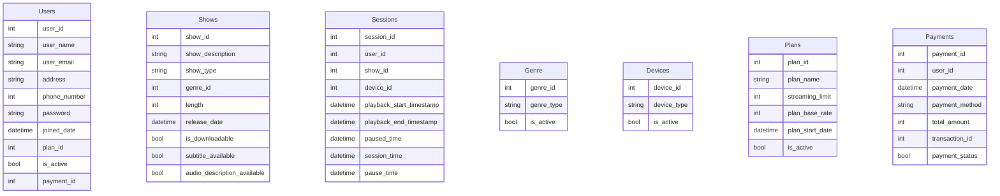

# Problem Statement
Develop a high level design of a robust and user-centric video streaming service that offers a vast library of TV shows, and movies, delivering a seamless, and personalized viewing experience across multiple platforms on subscription basis.

# Agenda
This document aims to develop the high level design of the said system, while describing the principles of high level design.

# What is System Design?
System design is the process of defining the architecture, components, modules, and interfaces of a software system to ensure it meets the specified requirements. It involves breaking a complex system down into smaller, manageable parts while considering factors like performance, scalability, maintainability, and security.

### Key aspects of system design
- Architectural patterns: Selecting appropriate architectural styles (e.g., layered, microservices, event-driven) based on the system's requirements and goals.
- Component design: Designing individual components or modules within the system, defining their responsibilities and interactions.
- Data flow: Modeling how data flows through the system, including input, processing, and output.
- Interface design: Specifying how components communicate with each other, including the data exchanged and the protocols used.
- Non-functional requirements: Considering factors like performance, scalability, security, and maintainability during the design process.

### Phases in system design
System design is typically performed in 2 phases,
1. High level design (HLD): Provides a conceptual averview of the system's architecture, focusing on the major components and their interactions.
2. Low level design (LLD): Defines the detailed design of individual components, including data structures, algorithms, and interfaces.

### How to select the appropriate architectural pattern for the system?
The concept of logical separation is used to achieve this. Logical separation in system design refers to the process of dividing a system into distinct functional units or modules based on their logical relationships and responsibilities. This separation helps to,
- Improve modularity: Each module can be developed, tested, and maintained independently, enhancing code organization and reusability.
- Enhance maintainability: Changes to one module are less likely to impact other parts of the system, reducing the risk of unintended side effects.
- Promote reusability: Well-defined modules can be reused in other projects, saving development time and effort.
- Improve understandability: The system becomes easier to understand and reason about when it is logically separated into cohesive units.

Common techniques for logical separation are,
- Layered architecture: The system is divided into layers based on their logical functions, such as presentation, business logic, and data access. Each layer is responsible for specific tasks, promoting separation of concerns and improving maintainability.
- Microservices architecture: The system is broken down into small, independently deployable services, each focused on a specific business capability. This approach emphasizes logical separation and enables scalability and flexibility.
- Component based architecture: The system is built from reusable components that provide specific functionalities. These components are designed to be independent and can be combined in different ways to create various applications, promoting logical separation and code reuse.

# What is High Level Design?
High level design (HLD) is a conceptual representation of a software system's architecture, focusing on the overall structure, components, and their interactions. It provides a blueprint for the system's design, outlining the key modules, their responsibilities, and how they communicate with each other.

HLD serves as a foundation for the detailed design phase, providing a clear direction for the development team. It helps in,
- Understanding the system as a whole.
- Identifying dependencies between different modules.
- Evaluating different architectural design alternatives.
- Communicating design decisions with all the stake holders.

HLD is essentially a bridge between the problem domain and the detailed design. It helps in laying down a roadmap for building a robust and efficient software system

### Key elements of HLD
- System architecture: The overall structure and organization of the system, often depicted using diagrams like UML (Unified Modeling Language) component diagrams.
- Module identification: Breaking down the system into logical components or modules, each with a specifci purpose.
- Module relationships: Defining how modules interact with each other, including data flow and control flow.
- Interfaces: Specifying the communication points between modules including the data exchanged and the protocols used.
- Non-functional requirements: Considering factors like performance, security, scalability, and maintainability.

# Functional Requirements of a Video Streaming Platform

### Content library
- Extensive catalog of movies, TV shows, docuseries, and other video content.
- Ability to categorize content by genre, release year, rating, and other relevant criteria.
- Support for different languages and subtitles.

### User profiles
- Allow users to create personalized profiles with viewing history, recommendations, and watchlists.
- Support for multiple profiles within a single account.

### Video playback
- High-quality video playback with adaptive streaming to adjust to varying network connections.
- Support for multiple resolutions and frame rates.
- Ability to pause, resume, rewind and fast-forward videos.

### Search and discovery
- Efficient search functionality to find specific content.
- Personalized recommendations based on viewing history and preferences.
- Curated collections and playlists.

### Offline viewing
- Support to download content for offline viewing on compatible devices.

### Social features
- Users should have an option to like, comment, and rate content.
- Social sharing options to share content with friends and family.

### Payment support
- Support should be available for most of the popular payment methods (Debit Card, Credit Card, UPI, etc.).

### Parental controls
- Restricted profiles to limit content access for childern.
- PIN protection for parental controls.

### Multi-device support
- Compatibility with various devices, including smartphones, tablets, computers, and smart TVs.

# Non-Functional Requirements for a Video Streaming Platform
Non-functional requirements (NFRs) define the quality attribute of a system, ensuring it meets user expectations and operates effectively.

### Performance
- Response time: Ensure quick response times for user actions, such as searching, playing and pausing videos.
- Throughput: Handle a large number of concurrent users and streams without significant degradation in performance.
- Scalability: The system should be able to scale up or down to accomodate changes in user demand.
- Buffering: Minimize buffering during video playback, especially over slower etwork connections.

### Reliability
- Uptime: Maintain high availability and minimize downtime.
- Data integrity: Ensure data consistency and accuracy, including user profiles, viewing history, and content metadata.
- Error handling: Implement robust error handling mechanisms to gracefully handle exceptions and prevent system crashes.

### Security
- Data privacy: Protect user data, including personal information and viewing history from unauthorized access.
- Content protection: Prevent unauthorized copying, distribution or privacy of content.
- Secure authentication: Implement secure authentication and authorization mechanisms to protect user accounts.
- Compliance: Adhere to relevant data privacy regulations (e.g., GDPR, CCPA).

### Usability
- User interface: Design an intuitive and user-friendly interface that is easy to navigate.
- Accessibility: Ensure the platform is accessible to users with disabilities.
- Localization: Support multiple languages and regions to cater to a global audience.

### Maintainability:
- Modularity: Design the system with well-defined modules to facilitate maintenance and updates.
- Documentation: Provide comprehensive documentation for developers and administrators.
- Testability: Ensure the system is testable with automated testing tools and frameworks.

### Cost
- Cost-effectiveness: Optimize resource utilization and minimize operational costs.
- Scalability: The system should be scalable to accommodate growth without excessive cost.

# Assumptions About the Video Streaming Platform
1. The platform has atleast 1 billion users, and out of those atleast 200 million are active users.
2. The has atleast 1 million videos.
3. The platform sees atleast 1000 videos being uploaded everyday.
4. The platform witnesses at least 1 billion requests per day (12000 requests per day).

# Data Model (ER Diagram) for the Video Streaming Platform

Value (left)	Value (right)	Meaning
|o	            o|	            Zero or one
||	            ||	            Exactly one
}o	            o{	            Zero or more (no upper limit)
}|	            |{	            One or more (no upper limit)

# Data Storage